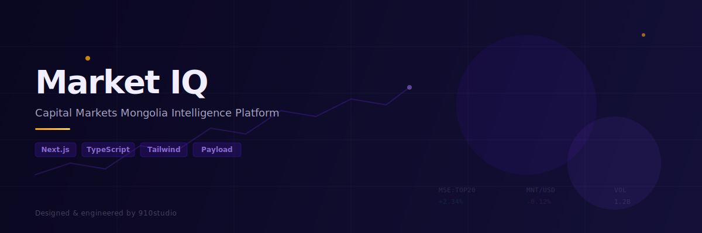
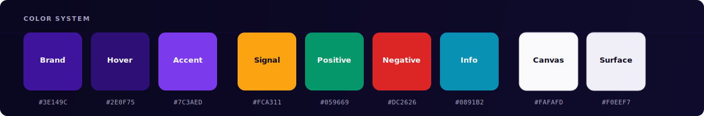

<p align="center">
  
</p>

<p align="center">
  <strong>Intelligence platform for global investors evaluating Mongolian capital markets.</strong><br/>
  <sub>Replacing capitalmarkets.mn with a platform built from the ground up.</sub>
</p>

<p align="center">
  
  
  
  
  
</p>

---

## What is Market IQ?

Market IQ is an intelligence platform that gives global institutional investors structured, English-language access to Mongolian capital markets — a market that Bloomberg doesn't cover and standard financial tools can't reach.

**v1 ships:** Searchable entity directory (100+ companies), migrated content library (150 articles), live market feed, events hub, and a 3-tier access model (Public → Registered → Paid).

**v2 unlocks:** AI-powered research workspace built on the v1 data layer.

---

## Design Direction

> **"Creative, Sophisticated yet Corp"** — AlphaSense readability meets Koyfin data density meets CMM brand identity.



<br/>


<br/>

### Key Design Decisions

| Decision | Direction |
|----------|-----------|
| Canvas | Light lavender `#FAFAFD` — not stark white, not grey |
| Brand | Deep institutional purple `#3E149C` — surgical, not saturated |
| Data | JetBrains Mono for all financial figures — tabular-nums, right-aligned |
| Density | Desktop-first for institutional desk users. Data IS the design |
| Motion | Polished but sub-600ms. No bounce. No carnival |
| Shadows | Brand-tinted at low opacity — `rgba(62, 20, 156, 0.04→0.12)` |
| Buttons | 8px radius. Never pill-shaped. Never "Submit" |

### References

| Platform | What we're stealing |
|----------|-------------------|
| **AlphaSense** | Readability. Info hierarchy. Dense financial text without clutter |
| **Koyfin** | Data density done right. Chart UX. Multi-data-type presentation |
| **Linear** | Surface/elevation system. Component polish. Loading states |
| **Crunchbase** | Company directory UX. Card layouts. Filter sidebar patterns |

---

## Architecture

```
app/
├── (marketing)/          # Landing, about — public pages
├── (platform)/           # Authenticated platform shell
│   ├── directory/        # Entity directory + profiles
│   ├── insights/         # Articles, research, insider content
│   ├── feed/             # AI-aggregated market news
│   └── events/           # Events hub + detail pages
├── (auth)/               # Clerk auth flows
└── api/                  # API routes
```

### Widget System

Entity profiles render dynamic widgets based on `layout_config` — each entity type gets a tailored set:

```
MarketDataWidget        → Stock charts, price, volume (public companies)
FinancialPerformanceWidget → Multi-year balance sheet, P&L, cash flow
DealActionWidget        → Active raises, "Request Connection" CTA
ProjectTechnicalWidget  → Mining/energy specs (commodity, reserves, grade)
KeyPersonnelWidget      → Leadership grid with photos + bios
CMMResearchWidget       → Linked research articles (max 5)
```

### Access Tiers

```
Public        → Landing, directory browsing, 3 free articles
Registered    → Full directory, metered content (10 articles/month)
Paid          → Unlimited content, connection requests, premium research
```

---

## Getting Started

```bash
# Install
npm install

# Dev server
npm run dev

# Build
npm run build
```

Open [localhost:3000](http://localhost:3000).

---

## Stack

| Layer | Tech |
|-------|------|
| Framework | Next.js 16 (App Router, Server Components) |
| Language | TypeScript 5 (strict) |
| Styling | Tailwind CSS 4 |
| CMS | Payload CMS |
| Auth | Clerk (3-tier access) |
| Fonts | Plus Jakarta Sans 800 / DM Sans 400 / JetBrains Mono 500 |

---

<p align="center">
  <sub>Designed & engineered by <strong>910studio</strong> for Capital Markets Mongolia</sub><br/>
  <sub>Target: May 2026</sub>
</p>
